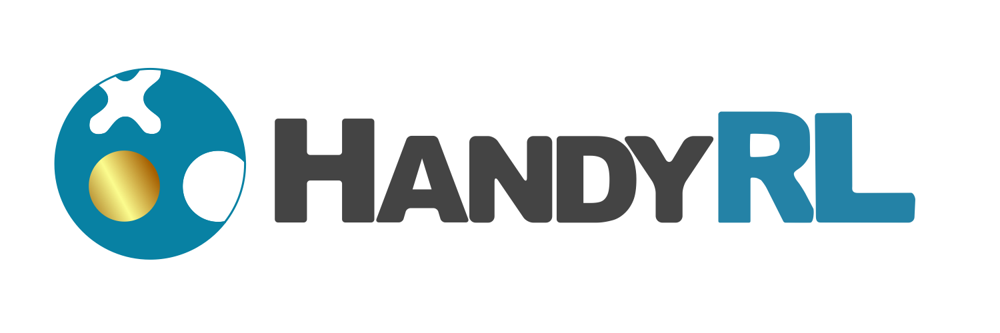

**HandyRL is a handy and simple framework for distributed reinforcement learning that is applicable to your own environments.**

Note: Python2 is not supported.

## Dependencies
```shell
pip install -r requirements.txt
```

## How to use

### configuration

Set `config.yaml` for your own configuration.

### Training

```shell
python main.py --train
```

### Evaluation

```shell
python main.py --eval
```

## How to use (for large scale training)

If you use remote machines as worker clients, you can set worker configuation in each client.

```shell
python main.py --train-server
```

In another window,
```shell
python main.py --worker
```

## Using your own environments

Write wrapper class named `Environment` following the format of the sample environment code `environments/tictactoe.py` or `environments/geister.py`.

```python
from environment import BaseEnvironment

class Environment(BaseEnvironment):
    def reset(self, args):
        ...
    def play(self, action, player):
        ...
    def terminal(self):
        ...
    def reward(self):
        ...
    def legal_actions(self, player):
        ...
    def action_length(self):
        ...
    def observation(self, player):
        ...
```

Set `'env'` and `'source'` variables in `config.yaml` as the name and path of your own environment.
